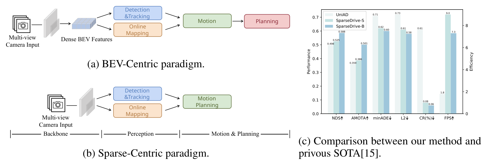
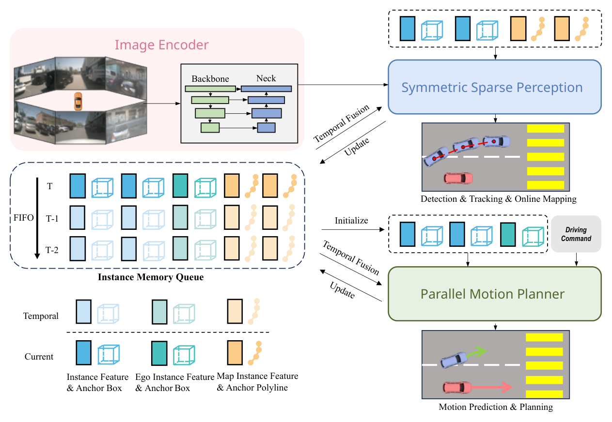
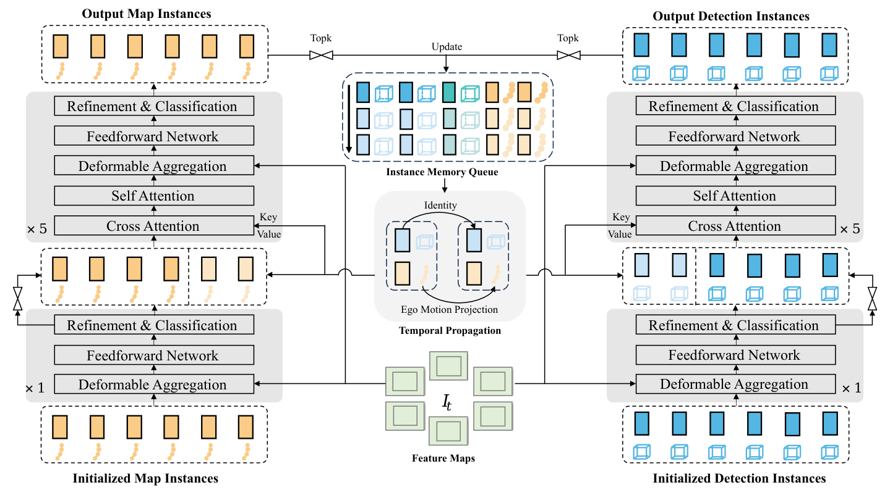
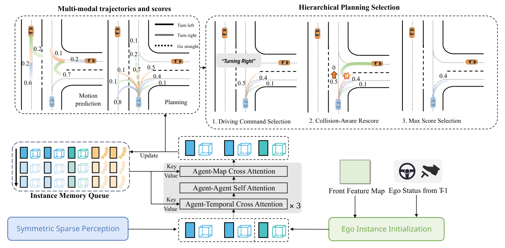
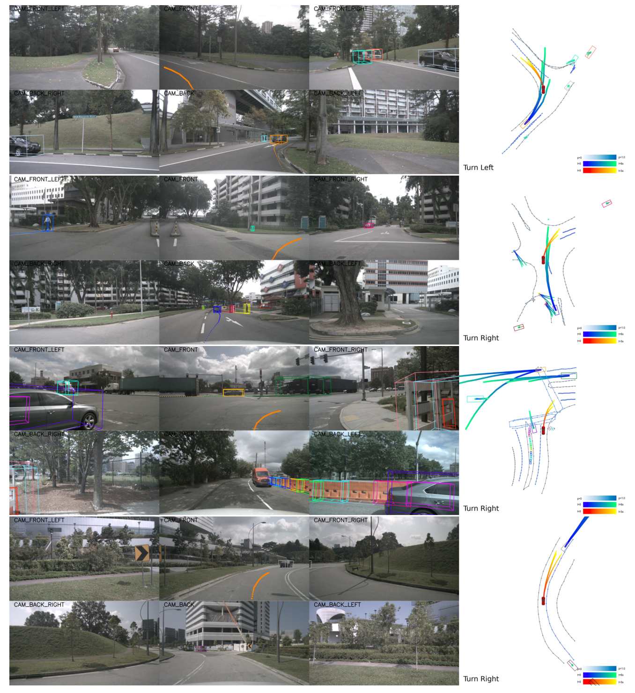
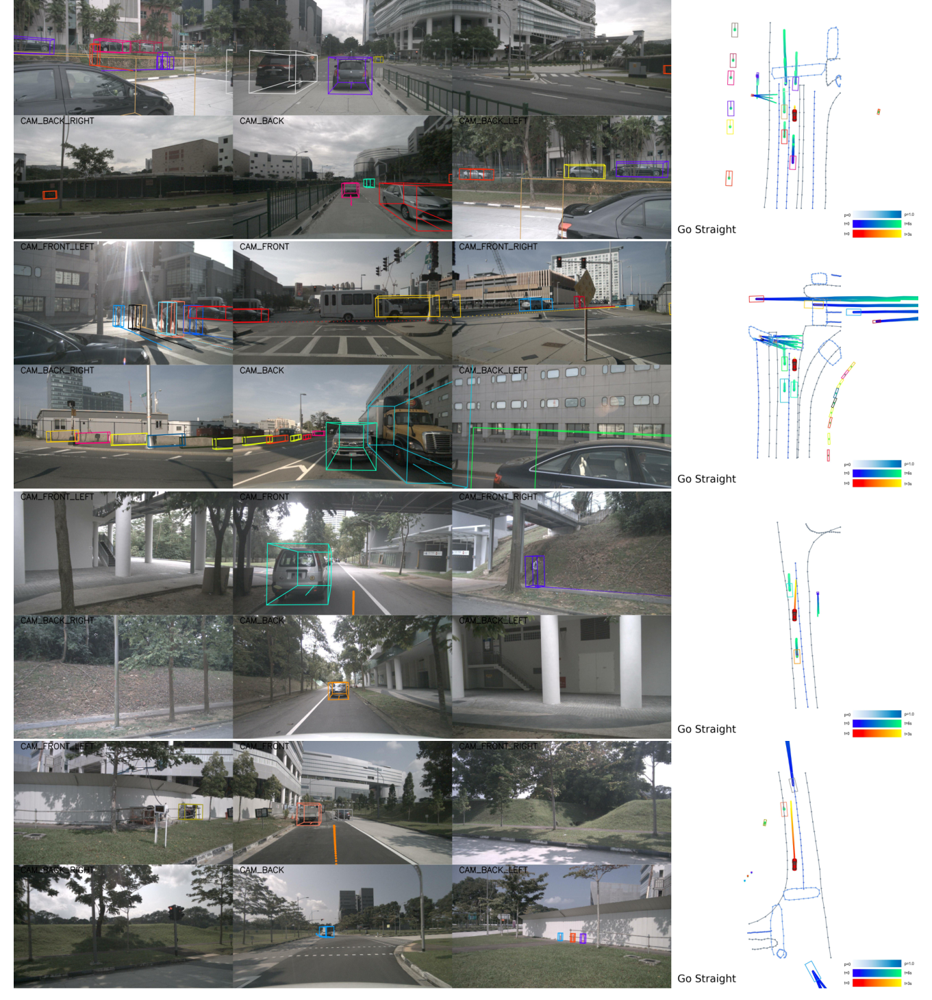

# SparseDrive：基于稀疏场景表示的端到端自动驾驶

Wenchao Sun1,2，Xuewu Lin2，Yining Shi1，Chuang Zhang1，Haoran Wu1，Sifa Zheng1  
1 清华大学　2 地平线

> 译者说明：本文档为论文 **SparseDrive: End-to-End Autonomous Driving via Sparse Scene Representation** 的中文翻译版。论文中的原始图像已裁剪保存到 `assets/` 文件夹，并在正文中按原文位置插入；表格转写为 Markdown 表格；参考文献保留英文原文，便于检索。

---

## 摘要

成熟的模块化自动驾驶系统通常被解耦为不同的独立任务，例如感知、预测和规划。这种设计会在模块之间造成信息损失和误差累积。相比之下，端到端范式将多任务统一到一个完全可微的框架中，使模型能够以“面向规划”的方式进行优化。尽管端到端范式潜力巨大，现有方法在性能和效率方面仍不令人满意，尤其是在规划安全性方面。我们认为，这主要源于计算代价较高的 BEV（bird's eye view，鸟瞰图）特征，以及对预测和规划任务过于直接的设计。

为此，我们探索稀疏表示，并重新审视端到端自动驾驶中的任务设计，提出一种新的范式：**SparseDrive**。具体而言，SparseDrive 由一个**对称稀疏感知模块**和一个**并行运动规划器**组成。稀疏感知模块使用对称模型结构统一检测、跟踪和在线建图，学习驾驶场景的完全稀疏表示。对于运动预测和规划，我们重新审视这两个任务之间的高度相似性，并据此提出运动规划器的并行设计。在这种并行设计的基础上，规划被建模为一个多模态问题；随后我们提出一种**层次化规划选择策略**，其中结合了**碰撞感知重评分模块**，用于选择合理且安全的轨迹作为最终规划输出。

凭借这些有效设计，SparseDrive 在所有任务的性能上大幅超过此前最先进方法，同时实现更高的训练和推理效率。代码将开放于：`https://github.com/swc-17/SparseDrive`，以促进后续研究。

---

## 1 引言

传统自动驾驶系统通常按照顺序组织为多个模块化任务。该系统具有较好的可解释性，也便于错误追踪，但它不可避免地会在连续模块之间导致信息损失和误差累积，从而限制系统性能的最优潜力。

近年来，端到端驾驶范式成为一个很有前景的研究方向。这一范式将所有任务整合到一个整体模型中，并可以朝着最终的规划目标进行优化。然而，现有方法 [15, 20] 在性能和效率方面仍不令人满意。一方面，以往方法依赖计算代价较高的 BEV 特征；另一方面，预测和规划任务中直接串行的设计限制了模型性能。我们将以往方法概括为图 1a 中的 **BEV-Centric** 范式。

**图 1：** 不同端到端范式的比较。a）BEV-Centric 范式。b）本文提出的 Sparse-Centric 范式。c）本文方法与此前 SOTA 方法 [15] 在性能和效率上的比较。

为了充分发挥端到端范式的潜力，我们重新审视现有方法中的任务设计，并指出运动预测和规划之间有三个被忽略的主要共性：

1. 二者都旨在预测周围智能体与自车未来轨迹，因此都应考虑道路智能体之间的高阶、双向交互。然而，以往方法通常采用运动预测再规划的顺序设计，忽略了自车对周围智能体的影响。
2. 准确预测未来轨迹需要语义信息来理解场景，同时需要几何信息来预测智能体的未来运动。这一点同样适用于运动预测和规划。虽然这些信息会在上游感知任务中为周围智能体提取，但对自车而言通常被忽视。
3. 运动预测和规划都具有内在不确定性，都是多模态问题，但以往方法只为规划预测确定性轨迹。

为此，我们提出 SparseDrive，即图 1b 所示的 **Sparse-Centric** 范式。具体来说，SparseDrive 由对称稀疏感知模块和并行运动规划器组成。对于一个实例（动态道路智能体或静态地图元素），使用解耦的实例特征和几何锚点作为完整表示；在此基础上，**对称稀疏感知**通过对称模型架构统一检测、跟踪和在线建图任务，学习完全稀疏的场景表示。在**并行运动规划器**中，首先由自车实例初始化模块得到一个具有语义和几何感知能力的自车实例。随后，利用自车实例以及来自稀疏感知的周围智能体实例，同时进行运动预测和规划，为所有道路智能体获得多模态轨迹。为了保证规划的合理性和安全性，本文使用结合碰撞感知重评分模块的层次化规划选择策略，从多模态轨迹候选中选择最终规划轨迹。

借助上述有效设计，SparseDrive 释放了端到端自动驾驶的巨大潜力，如图 1c 所示。在不使用复杂技巧的情况下，基础模型 SparseDrive-B 将平均 L2 误差降低了 19.4%（0.58 m vs. 0.72 m），将碰撞率降低了 71.4%（0.06% vs. 0.21%）。与此前 SOTA 方法 UniAD [15] 相比，小模型 SparseDrive-S 在所有任务上都取得更优性能，同时训练速度提升 7.2 倍（20 h vs. 144 h），推理速度提升 5.0 倍（9.0 FPS vs. 1.8 FPS）。

本文主要贡献如下：

- 探索端到端自动驾驶中的稀疏场景表示，提出名为 SparseDrive 的 Sparse-Centric 范式，以稀疏实例表示统一多个任务。
- 重新审视运动预测与规划之间的高度相似性，并据此提出运动规划器的并行设计；进一步提出结合碰撞感知重评分模块的层次化规划选择策略，以提升规划性能。
- 在具有挑战性的 nuScenes [1] 基准上，SparseDrive 在所有指标上超过此前 SOTA 方法，尤其是在安全关键指标碰撞率上表现突出，同时保持更高的训练和推理效率。

---

## 2 相关工作

### 2.1 多视角 3D 检测

多视角 3D 检测是自动驾驶系统安全性的前提。LSS [42] 使用深度估计将图像特征提升到 3D 空间，并将特征投影到 BEV 平面上。后续工作将 lift-splat 操作应用于 3D 检测领域，并在精度 [18, 16, 25, 24] 和效率 [37, 17] 上取得显著提升。另一些工作 [26, 48, 21, 5] 预定义一组 BEV queries，并将其投影到透视视图中进行特征采样。还有一条研究路线移除了对稠密 BEV 特征的依赖。PETR 系列 [35, 36, 47] 引入 3D 位置编码和全局注意力，以隐式学习视角变换。Sparse4D 系列 [31, 32, 33] 在 3D 空间中设置显式锚点，将其投影到图像视图以聚合局部特征，并以迭代方式细化锚点。

### 2.2 端到端跟踪

多数多目标跟踪（MOT）方法采用 tracking-by-detection 方式，依赖数据关联等后处理流程。这类流水线无法充分发挥神经网络的能力。受 [2] 中 object query 的启发，一些工作 [52, 55, 50, 41, 46, 54] 引入 track query，以流式方式建模被跟踪实例。MOTR [52] 提出 tracklet-aware 标签分配，迫使 track query 连续检测同一目标，但会受到检测和关联之间冲突的影响 [55, 50]。Sparse4Dv3 表明，时间传播的实例本身已经具有身份一致性，并通过简单的 ID 分配流程实现了 SOTA 跟踪性能。

### 2.3 在线建图

由于高精地图构建成本高、人工投入大，在线建图被提出作为高精地图的替代方案。HDMapNet [23] 将 BEV 语义分割与后处理结合，得到矢量化地图实例。VectorMapNet [34] 使用两阶段自回归 Transformer 进行在线地图构建。MapTR [29] 将地图元素建模为等价排列的点集，从而避免地图元素定义歧义。BeMapNet 使用分段 Bezier 曲线描述地图元素细节。StreamMapNet [51] 引入 BEV 融合和 query 传播进行时间建模。

### 2.4 端到端运动预测

端到端运动预测旨在避免传统流水线中的级联误差。FaF [40] 使用单个卷积网络同时预测当前和未来边界框。IntentNet [3] 进一步推理高层行为和长期轨迹。PnPNet [28] 引入在线跟踪模块来聚合轨迹级特征，用于运动预测。ViP3D [10] 使用 agent queries 执行跟踪和预测，并以图像和高精地图作为输入。PIP [19] 使用局部矢量化地图替代人工标注的高精地图。

### 2.5 端到端规划

端到端规划的研究可以追溯到上世纪 [43]。早期工作 [6, 7, 44] 省略了感知和运动预测等中间任务，因此缺乏可解释性且难以优化。一些工作 [14, 4, 45, 8] 根据感知或预测结果构建显式代价地图，以增强可解释性，但仍依赖手工规则来选择总代价最小的最佳轨迹。近期，UniAD [15] 提出统一 query 设计，将多种任务整合到面向目标的模型中，在感知、预测和规划上取得了显著性能。VAD [20] 使用矢量化表示进行场景学习和规划约束。GraphAD [56] 使用图模型表示交通场景中的复杂交互。FusionAD [49] 将端到端驾驶扩展到多传感器输入。然而，以往方法主要关注场景学习，并在预测和规划上采用直接设计，没有充分考虑这两个任务之间的相似性，从而显著限制了性能。

---

## 3 方法

### 3.1 概览

**图 2：** SparseDrive 总览。SparseDrive 首先将多视角图像编码为特征图，然后通过对称稀疏感知学习稀疏场景表示，最后以并行方式进行运动预测和规划。模型设计了一个实例记忆队列用于时间建模。

SparseDrive 的整体框架如图 2 所示。具体而言，SparseDrive 由三部分组成：图像编码器、对称稀疏感知和并行运动规划器。给定多视角图像后，图像编码器（包括 backbone 网络和 neck）首先将图像编码为多视角、多尺度特征图：

$$
I = \{ I_s \in \mathbb{R}^{N \times C \times H_s \times W_s} \mid 1 \le s \le S \},
$$

其中，$S$ 是尺度数量，$N$ 是相机视角数量。在对称稀疏感知模块中，特征图 $I$ 被聚合为两组实例，用于学习驾驶场景的稀疏表示。这两组实例分别表示周围智能体和地图元素，并被输入到并行运动规划器中，与初始化后的自车实例进行交互。运动规划器同时预测周围智能体和自车的多模态轨迹，并通过层次化规划选择策略选择安全轨迹作为最终规划结果。

### 3.2 对称稀疏感知

如图 3 所示，稀疏感知模块的模型结构具有结构对称性，将检测、跟踪和在线建图统一起来。

**图 3：** 对称稀疏感知的模型架构。该结构以对称方式统一检测、跟踪和在线建图。

**稀疏检测。** 周围智能体由一组实例特征 $F_d \in \mathbb{R}^{N_d \times C}$ 和锚框 $B_d \in \mathbb{R}^{N_d \times 11}$ 表示，其中 $N_d$ 是锚点数量，$C$ 是特征通道维度。每个锚框包含位置、尺寸、偏航角和速度，格式为：

$$
\{x, y, z, \ln w, \ln h, \ln l, \sin yaw, \cos yaw, v_x, v_y, v_z\}.
$$

稀疏检测分支包含 $N_{dec}$ 个解码器，其中包括一个非时间解码器和 $N_{dec}-1$ 个时间解码器。每个解码器以特征图 $I$、实例特征 $F_d$ 和锚框 $B_d$ 作为输入，输出更新后的实例特征和细化后的锚框。非时间解码器以随机初始化实例作为输入，而时间解码器的输入同时来自当前帧和历史帧。具体而言，非时间解码器包含三个子模块：可变形聚合、前馈网络（FFN）以及用于细化和分类的输出层。可变形聚合模块在锚框 $B_d$ 周围生成固定或可学习的关键点，并将其投影到特征图 $I$ 上进行特征采样。实例特征 $F_d$ 通过与采样特征求和而更新，并在输出层中负责预测分类分数和锚框偏移。时间解码器额外包含两个多头注意力层：上一帧时间实例与当前实例之间的时间交叉注意力，以及当前实例之间的自注意力。在多头注意力层中，锚框被转换为高维锚点嵌入 $E_d \in \mathbb{R}^{N_d \times C}$，并作为位置编码。

**稀疏在线建图。** 在线建图分支与检测分支共享相同的模型结构，不同之处在于实例定义。对于静态地图元素，锚点被表述为含有 $N_p$ 个点的折线：

$$
\{x_0, y_0, x_1, y_1, \ldots, x_{N_p-1}, y_{N_p-1}\}.
$$

因此，所有地图元素可以由地图实例特征 $F_m \in \mathbb{R}^{N_m \times C}$ 和锚折线 $L_m \in \mathbb{R}^{N_m \times N_p \times 2}$ 表示，其中 $N_m$ 是锚折线数量。

**稀疏跟踪。** 对于跟踪，本文遵循 Sparse4Dv3 [33] 的 ID 分配流程：一旦某个实例的检测置信度超过阈值 $T_{thresh}$，该实例就会锁定到一个目标并被分配一个 ID，该 ID 在时间传播过程中保持不变。这种跟踪策略不需要任何跟踪约束，从而为稀疏感知模块带来了优雅且简单的对称设计。

### 3.3 并行运动规划器

如图 4 所示，并行运动规划器由三部分组成：自车实例初始化、时空交互和层次化规划选择。

**图 4：** 并行运动规划器的模型结构。该模块同时执行运动预测和规划，并输出安全的规划轨迹。

**自车实例初始化。** 与周围智能体类似，自车由自车实例特征 $F_e \in \mathbb{R}^{1 \times C}$ 和自车锚框 $B_e \in \mathbb{R}^{1 \times 11}$ 表示。在以往方法中，自车特征通常是随机初始化的；但我们认为，与运动预测类似，用于规划的自车特征同样需要丰富的语义和几何信息。然而，周围智能体的实例特征是从图像特征图 $I$ 聚合得到的，这对自车并不可行，因为自车位于相机盲区。因此，本文使用前视相机最小尺度特征图来初始化自车实例特征：

$$
F_e = \mathrm{AveragePool}(I_{front,S}) \tag{1}
$$

这样做有两个优点：第一，最小尺度特征图已经编码了驾驶场景的语义上下文；第二，稠密特征图可以作为稀疏场景表示的补充，以应对某些无法在稀疏感知中被检测到的黑名单障碍物。

对于自车锚点 $B_e$，由于已知自车的信息，其位置、尺寸和偏航角可以自然设定。对于速度，如果直接使用真实速度初始化，会导致自车状态泄漏，如 [27] 所述。因此，我们增加一个辅助任务来解码当前自车状态 $ES_T$，包括速度、加速度、角速度和转向角。在每一帧中，我们使用上一帧预测的速度作为自车锚点速度的初始化。

**时空交互。** 为了考虑所有道路智能体之间的高层交互，本文将自车实例与周围智能体拼接，得到智能体级实例：

$$
F_a = \mathrm{Concat}(F_d, F_e), \quad B_a = \mathrm{Concat}(B_d, B_e) \tag{2}
$$

由于自车实例初始化时不包含时间线索，而时间线索对规划非常重要，因此本文设计了一个大小为 $(N_d+1) \times H$ 的实例记忆队列用于时间建模，其中 $H$ 是存储的历史帧数量。随后执行三类交互来聚合时空上下文：agent-temporal cross-attention、agent-agent self-attention 和 agent-map cross-attention。需要注意的是，在稀疏感知模块的时间交叉注意力中，当前帧实例会与所有时间实例交互，我们将其称为场景级交互；而这里的 agent-temporal cross-attention 采用实例级交互，使每个实例关注自身的历史信息。

随后，模型同时为周围智能体和自车预测多模态轨迹 $\tau_m \in \mathbb{R}^{N_d \times K_m \times T_m \times 2}$、$\tau_p \in \mathbb{R}^{N_c \times K_p \times T_p \times 2}$ 以及分数 $s_m \in \mathbb{R}^{N_d \times K_m}$、$s_p \in \mathbb{R}^{N_{cmd} \times K_p}$。其中，$K_m$ 和 $K_p$ 分别是运动预测和规划的模态数量，$T_m$ 和 $T_p$ 分别是运动预测和规划的未来时间戳数量，$N_{cmd}$ 是用于规划的驾驶指令数量。按照常见做法 [15, 20]，本文使用三类驾驶指令：左转、右转和直行。对于规划任务，本文还额外从自车实例特征中预测当前自车状态。

**层次化规划选择。** 现在已经有多模态规划轨迹候选。为了选择一条安全轨迹 $\tau_p^*$ 进行跟随，本文设计了层次化规划选择策略。首先，模型根据高层驾驶指令 $cmd$ 选择一组对应的轨迹候选 $\tau_{p,cmd} \in K_p \times T_p \times 2$。随后，采用一种新的碰撞感知重评分模块来保证安全性。利用运动预测结果，可以评估每条规划轨迹候选的碰撞风险；对于碰撞概率较高的轨迹，降低其分数。实际实现中，我们简单地将发生碰撞的轨迹分数设为 0。最后，选择分数最高的轨迹作为最终规划输出。

### 3.4 端到端学习

**多阶段训练。** SparseDrive 的训练分为两个阶段。在 stage-1 中，从头训练对称稀疏感知模块，以学习稀疏场景表示。在 stage-2 中，对稀疏感知模块和并行运动规划器进行联合训练，且不冻结任何模型权重，从而充分受益于端到端优化。更多训练细节见附录 B.4。

**损失函数。** 损失函数包含四个任务的损失，每个任务的损失又可进一步分为分类损失和回归损失。对于多模态运动预测和规划任务，本文采用 winner-takes-all 策略。对于规划任务，额外包含自车状态回归损失。本文还引入深度估计作为辅助任务，以增强感知模块的训练稳定性。端到端训练的总体损失函数为：

$$
L = L_{det} + L_{map} + L_{motion} + L_{plan} + L_{depth}. \tag{3}
$$

更多损失函数细节见附录 B.3。

---

## 4 实验

本文实验在具有挑战性的 nuScenes [1] 数据集上进行。该数据集包含 1000 个复杂驾驶场景，每个场景约持续 20 秒。各任务的评估指标见附录 A。本文有两个模型变体，它们仅在 backbone 网络和输入图像分辨率上不同。对于小模型 SparseDrive-S，本文使用 ResNet50 [11] 作为 backbone，输入图像尺寸为 $256 \times 704$。对于基础模型 SparseDrive-B，本文将 backbone 改为 ResNet101，输入图像尺寸为 $512 \times 1408$。所有实验均在 8 张 NVIDIA RTX 4090 24GB GPU 上进行。更多配置细节见附录 B。

### 4.1 主要结果

本文与此前最先进的方法进行比较，包括模块化方法和端到端方法。在端到端方法中，轻量模型 SparseDrive-S 已在所有任务上超过此前 SOTA，而基础模型 SparseDrive-B 进一步提升了性能边界。每个任务的主要指标在原文表格中以灰色背景标出。

**感知。** 对于表 1a 中的 3D 检测，SparseDrive 达到 49.6% mAP 和 58.8% NDS，相比 UniAD [15] 分别显著提升 +11.6% mAP 和 +9.0% NDS。对于表 1b 中的多目标跟踪，SparseDrive 达到 50.1% AMOTA，并获得最低的 ID switch 数 632；相较 UniAD [15]，AMOTA 提升 +14.2%，ID switch 降低 30.2%，体现出跟踪 tracklet 的时间一致性。对于表 1c 中的在线建图，SparseDrive 达到 56.2% mAP，相较此前端到端方法 VAD [20] 提升 +8.6%。

**表 1：** nuScenes val 数据集上的感知结果。SparseDrive 在端到端方法中所有感知任务上取得最佳性能。† 表示使用官方 checkpoint 复现。

**表 1a：3D 检测结果**

| 方法 | Backbone | mAP ↑ | mATE ↓ | mASE ↓ | mAOE ↓ | mAVE ↓ | mAAE ↓ | NDS ↑ |
|---|---|---:|---:|---:|---:|---:|---:|---:|
| UniAD† [15] | ResNet101 | 0.380 | 0.684 | 0.277 | 0.383 | 0.381 | 0.192 | 0.498 |
| SparseDrive-S | ResNet50 | 0.418 | 0.566 | 0.275 | 0.552 | 0.261 | 0.190 | 0.525 |
| SparseDrive-B | ResNet101 | 0.496 | 0.543 | 0.269 | 0.376 | 0.229 | 0.179 | 0.588 |

**表 1b：多目标跟踪结果**

| 方法 | AMOTA ↑ | AMOTP ↓ | Recall ↑ | IDS ↓ |
|---|---:|---:|---:|---:|
| ViP3D [10] | 0.217 | 1.625 | 0.363 | - |
| QD3DT [12] | 0.242 | 1.518 | 0.399 | - |
| MUTR3D [54] | 0.294 | 1.498 | 0.427 | 3822 |
| UniAD [15] | 0.359 | 1.320 | 0.467 | 906 |
| SparseDrive-S | 0.386 | 1.254 | 0.499 | 886 |
| SparseDrive-B | 0.501 | 1.085 | 0.601 | 632 |

**表 1c：在线建图结果**

| 方法 | APped ↑ | APdivider ↑ | APboundry ↑ | mAP ↑ |
|---|---:|---:|---:|---:|
| HDMapNet [23] | 14.4 | 21.7 | 33.0 | 23.0 |
| VectorMapNet [34] | 36.1 | 47.3 | 39.3 | 40.9 |
| MapTR [29] | 56.2 | 59.8 | 60.1 | 58.7 |
| VAD† [20] | 40.6 | 51.5 | 50.6 | 47.6 |
| SparseDrive-S | 49.9 | 57.0 | 58.4 | 55.1 |
| SparseDrive-B | 53.2 | 56.3 | 59.1 | 56.2 |

**预测。** 对于表 2a 中的运动预测，SparseDrive 取得最佳性能：0.60 m minADE、0.96 m minFDE、13.2% MissRate 和 0.555 EPA。与 UniAD [15] 相比，SparseDrive 在 minADE 和 minFDE 上分别降低误差 15.5% 和 5.9%。

**规划。** 对于表 2b 中的规划，在所有方法中 SparseDrive 获得显著的规划性能，L2 误差最低为 0.58 m，碰撞率最低为 0.06%。与此前 SOTA VAD [20] 相比，SparseDrive 将 L2 误差降低 19.4%，将碰撞率降低 71.4%，体现了本文方法的有效性和安全性。

**效率。** 如表 3 所示，除了优秀性能外，SparseDrive 在训练和推理两方面也取得了更高效率。在相同 backbone 网络下，基础模型相比 UniAD [15] 训练速度快 4.8 倍，推理速度快 4.1 倍。轻量模型在训练和推理上分别快 7.2 倍和 5.0 倍。

**表 2：** nuScenes val 数据集上的运动预测和规划结果。SparseDrive 大幅超过以往方法。† 表示使用官方 checkpoint 复现；* 表示基于 LiDAR 的方法。

**表 2a：预测结果**

| 方法 | minADE (m) ↓ | minFDE (m) ↓ | MR ↓ | EPA ↑ |
|---|---:|---:|---:|---:|
| Cons Pos. [15] | 5.80 | 10.27 | 0.347 | - |
| Cons Vel. [15] | 2.13 | 4.01 | 0.318 | - |
| Traditional [10] | 2.06 | 3.02 | 0.277 | 0.209 |
| PnPNet [28] | 1.15 | 1.95 | 0.226 | 0.222 |
| ViP3D [10] | 2.05 | 2.84 | 0.246 | 0.226 |
| UniAD [15] | 0.71 | 1.02 | 0.151 | 0.456 |
| SparseDrive-S | 0.62 | 0.99 | 0.136 | 0.482 |
| SparseDrive-B | 0.60 | 0.96 | 0.132 | 0.555 |

**表 2b：规划结果**

| 方法 | L2 1s ↓ | L2 2s ↓ | L2 3s ↓ | L2 Avg. ↓ | Col. 1s ↓ | Col. 2s ↓ | Col. 3s ↓ | Col. Avg. ↓ |
|---|---:|---:|---:|---:|---:|---:|---:|---:|
| FF* [13] | 0.55 | 1.20 | 2.54 | 1.43 | 0.06 | 0.17 | 1.07 | 0.43 |
| EO* [22] | 0.67 | 1.36 | 2.78 | 1.60 | 0.04 | 0.09 | 0.88 | 0.33 |
| ST-P3 [14] | 1.33 | 2.11 | 2.90 | 2.11 | 0.23 | 0.62 | 1.27 | 0.71 |
| UniAD† [15] | 0.45 | 0.70 | 1.04 | 0.73 | 0.62 | 0.58 | 0.63 | 0.61 |
| VAD† [20] | 0.41 | 0.70 | 1.05 | 0.72 | 0.03 | 0.19 | 0.43 | 0.21 |
| SparseDrive-S | 0.29 | 0.58 | 0.96 | 0.61 | 0.01 | 0.05 | 0.18 | 0.08 |
| SparseDrive-B | 0.29 | 0.55 | 0.91 | 0.58 | 0.01 | 0.02 | 0.13 | 0.06 |

**表 3：** 效率比较结果。SparseDrive 在训练和推理上都具有高效率。UniAD 的训练时间和 FPS 分别在 8 张与 1 张 NVIDIA Tesla A100 GPU 上测得。SparseDrive 的训练时间和 FPS 分别在 8 张与 1 张 NVIDIA GeForce RTX 4090 GPU 上测得。

| 方法 | GPU Memory (G) | Batch Size | Time (h) | GPU Memory (M) | FLOPs (G) | Params (M) | FPS |
|---|---:|---:|---:|---:|---:|---:|---:|
| UniAD [15] | 50.0 | 1 | 48 + 96 | 2451 | 1709 | 125.0 | 1.8 |
| SparseDrive-S | 15.2 | 6 | 18 + 2 | 1294 | 192 | 85.9 | 9.0 |
| SparseDrive-B | 17.6 | 4 | 26 + 4 | 1437 | 787 | 104.7 | 7.3 |

### 4.2 消融实验

本文进行了大量消融实验，以证明设计选择的有效性。消融实验默认使用 SparseDrive-S 作为模型。

**运动规划器中各项设计的影响。** 为了强调考虑预测和规划之间相似性的重要性，本文设计了若干具体实验，如表 4 所示。ID-2 将预测与规划的并行设计改为顺序执行，从而忽略自车对周围智能体的影响，导致运动预测和碰撞率性能变差。ID-3 随机初始化自车实例特征，并将自车锚点所有参数设为 0。移除自车实例的语义和几何信息会导致 L2 误差和碰撞率都下降。ID-4 将规划视为确定性问题，只输出一条确定轨迹，因此碰撞率最高。ID-5 移除了实例级 agent-temporal cross-attention，使 L2 误差严重退化到 0.77 m。对于碰撞感知重评分，下一段将进行详细讨论。

**表 4：** 并行运动规划器设计的消融实验。“PAL” 表示运动预测和规划任务的并行设计；“EII” 表示自车实例初始化；“MTM” 表示规划多模态；“ATA” 表示 agent-temporal cross-attention；“CAR” 表示碰撞感知重评分。

| ID | PAL | EII | MTM | ATA | CAR | minADE | minFDE | MR | L2 1s | L2 2s | L2 3s | L2 Avg. | Coll. 1s | Coll. 2s | Coll. 3s | Coll. Avg. |
|---:|:---:|:---:|:---:|:---:|:---:|---:|---:|---:|---:|---:|---:|---:|---:|---:|---:|---:|
| 1 | ✓ | ✓ | ✓ | ✓ | ✓ | 0.623 | 0.987 | 0.136 | 0.29 | 0.58 | 0.96 | 0.61 | 0.01 | 0.05 | 0.18 | 0.08 |
| 2 |  | ✓ | ✓ | ✓ | ✓ | 0.641 | 1.008 | 0.138 | 0.30 | 0.58 | 0.95 | 0.61 | 0.02 | 0.06 | 0.23 | 0.10 |
| 3 | ✓ |  | ✓ | ✓ | ✓ | 0.621 | 0.988 | 0.135 | 0.31 | 0.60 | 0.98 | 0.63 | 0.03 | 0.07 | 0.21 | 0.11 |
| 4 | ✓ | ✓ |  | ✓ | ✓ | 0.626 | 1.002 | 0.136 | 0.33 | 0.66 | 1.08 | 0.69 | 0.03 | 0.11 | 0.60 | 0.25 |
| 5 | ✓ | ✓ | ✓ |  | ✓ | 0.634 | 1.003 | 0.138 | 0.40 | 0.74 | 1.16 | 0.77 | 0.02 | 0.13 | 0.32 | 0.16 |
| 6 | ✓ | ✓ | ✓ | ✓ |  | 0.623 | 0.987 | 0.136 | 0.29 | 0.58 | 0.95 | 0.61 | 0.01 | 0.06 | 0.30 | 0.12 |

**碰撞感知重评分。** 以往方法 [15, 56] 采用基于感知结果的后优化策略来确保安全性。然而，本文认为这种策略破坏了端到端范式，并导致 L2 误差明显退化，如表 5 所示。此外，在本文重新实现的碰撞率指标下，后优化并没有让规划更安全，反而更危险。相比之下，本文的碰撞感知重评分模块将碰撞率从 0.12% 降至 0.08%，同时 L2 误差仅有可忽略的增加，体现了本文方法的优越性。

**表 5：** 碰撞感知重评分与 [15] 中后优化策略的消融实验。

| 方法 | CAR | Post-optim. | L2 1s | L2 2s | L2 3s | L2 Avg. | Coll. 1s | Coll. 2s | Coll. 3s | Coll. Avg. |
|---|:---:|:---:|---:|---:|---:|---:|---:|---:|---:|---:|
| UniAD [15] |  |  | 0.32 | 0.58 | 0.94 | 0.61 | 0.15 | 0.24 | 0.36 | 0.25 |
| UniAD [15] |  | ✓ | 0.45 | 0.70 | 1.04 | 0.73 | 0.62 | 0.58 | 0.63 | 0.61 |
| SparseDrive |  |  | 0.29 | 0.58 | 0.95 | 0.61 | 0.01 | 0.06 | 0.30 | 0.12 |
| SparseDrive | ✓ |  | 0.29 | 0.58 | 0.96 | 0.61 | 0.01 | 0.05 | 0.18 | 0.08 |
| SparseDrive |  | ✓ | 0.44 | 0.73 | 1.11 | 0.76 | 0.29 | 0.21 | 0.38 | 0.30 |

**多模态规划。** 本文对规划模态数量进行了实验。如表 6 所示，随着规划模态数量增加，规划性能持续提升，直到 6 个模态时趋于饱和；这再次证明了多模态规划的重要性。

**表 6：** 规划模态数量消融实验。

| 模态数量 | L2 1s | L2 2s | L2 3s | L2 Avg. | Coll. 1s | Coll. 2s | Coll. 3s | Coll. Avg. |
|---:|---:|---:|---:|---:|---:|---:|---:|---:|
| 1 | 0.33 | 0.66 | 1.08 | 0.69 | 0.03 | 0.11 | 0.60 | 0.25 |
| 2 | 0.33 | 0.65 | 1.08 | 0.69 | 0.01 | 0.12 | 0.42 | 0.18 |
| 3 | 0.30 | 0.59 | 0.97 | 0.62 | 0.00 | 0.08 | 0.43 | 0.17 |
| 6 | 0.29 | 0.57 | 0.95 | 0.61 | 0.01 | 0.03 | 0.17 | 0.07 |
| 9 | 0.33 | 0.63 | 1.04 | 0.66 | 0.01 | 0.09 | 0.36 | 0.15 |

---

## 5 结论与未来工作

**结论。** 本文探索了端到端自动驾驶领域中的稀疏场景表示，并重新审视了任务设计。由此得到的端到端范式 SparseDrive 同时实现了显著性能和高效率。我们希望 SparseDrive 的出色表现能够启发社区重新思考端到端自动驾驶中的任务设计，并推动该领域技术进步。

**未来工作。** 本文仍存在一些局限。首先，端到端模型的性能仍落后于单任务方法，例如在线建图任务。其次，数据集规模尚不足以充分发挥端到端自动驾驶的全部潜力，而开环评估也无法全面反映模型性能。我们将这些问题留待未来探索。

---

## 参考文献（保留原文）

[1] Holger Caesar, Varun Bankiti, Alex H Lang, Sourabh Vora, Venice Erin Liong, Qiang Xu, Anush Krishnan, Yu Pan, Giancarlo Baldan, and Oscar Beijbom. nuscenes: A multimodal dataset for autonomous driving. In Proceedings of the IEEE/CVF conference on computer vision and pattern recognition, pages 11621-11631, 2020.

[2] Nicolas Carion, Francisco Massa, Gabriel Synnaeve, Nicolas Usunier, Alexander Kirillov, and Sergey Zagoruyko. End-to-end object detection with transformers. In European conference on computer vision, pages 213-229. Springer, 2020.

[3] Sergio Casas, Wenjie Luo, and Raquel Urtasun. Intentnet: Learning to predict intention from raw sensor data. In Conference on Robot Learning, pages 947-956. PMLR, 2018.

[4] Sergio Casas, Abbas Sadat, and Raquel Urtasun. Mp3: A unified model to map, perceive, predict and plan. In Proceedings of the IEEE/CVF Conference on Computer Vision and Pattern Recognition, pages 14403-14412, 2021.

[5] Shaoyu Chen, Tianheng Cheng, Xinggang Wang, Wenming Meng, Qian Zhang, and Wenyu Liu. Efficient and robust 2d-to-bev representation learning via geometry-guided kernel transformer. arXiv preprint arXiv:2206.04584, 2022.

[6] Felipe Codevilla, Matthias Müller, Antonio López, Vladlen Koltun, and Alexey Dosovitskiy. End-to-end driving via conditional imitation learning. In 2018 IEEE international conference on robotics and automation (ICRA), pages 4693-4700. IEEE, 2018.

[7] Felipe Codevilla, Eder Santana, Antonio M López, and Adrien Gaidon. Exploring the limitations of behavior cloning for autonomous driving. In Proceedings of the IEEE/CVF international conference on computer vision, pages 9329-9338, 2019.

[8] Alexander Cui, Sergio Casas, Abbas Sadat, Renjie Liao, and Raquel Urtasun. Lookout: Diverse multi-future prediction and planning for self-driving. In Proceedings of the IEEE/CVF International Conference on Computer Vision, pages 16107-16116, 2021.

[9] Tri Dao, Dan Fu, Stefano Ermon, Atri Rudra, and Christopher Ré. Flashattention: Fast and memory-efficient exact attention with io-awareness. Advances in Neural Information Processing Systems, 35:16344-16359, 2022.

[10] Junru Gu, Chenxu Hu, Tianyuan Zhang, Xuanyao Chen, Yilun Wang, Yue Wang, and Hang Zhao. Vip3d: End-to-end visual trajectory prediction via 3d agent queries. In Proceedings of the IEEE/CVF Conference on Computer Vision and Pattern Recognition, pages 5496-5506, 2023.

[11] Kaiming He, Xiangyu Zhang, Shaoqing Ren, and Jian Sun. Deep residual learning for image recognition. In Proceedings of the IEEE conference on computer vision and pattern recognition, pages 770-778, 2016.

[12] Hou-Ning Hu, Yung-Hsu Yang, Tobias Fischer, Trevor Darrell, Fisher Yu, and Min Sun. Monocular quasi-dense 3d object tracking. IEEE Transactions on Pattern Analysis and Machine Intelligence, 45(2):1992-2008, 2022.

[13] Peiyun Hu, Aaron Huang, John Dolan, David Held, and Deva Ramanan. Safe local motion planning with self-supervised freespace forecasting. In Proceedings of the IEEE/CVF Conference on Computer Vision and Pattern Recognition, pages 12732-12741, 2021.

[14] Shengchao Hu, Li Chen, Penghao Wu, Hongyang Li, Junchi Yan, and Dacheng Tao. St-p3: End-to-end vision-based autonomous driving via spatial-temporal feature learning. In European Conference on Computer Vision, pages 533-549. Springer, 2022.

[15] Yihan Hu, Jiazhi Yang, Li Chen, Keyu Li, Chonghao Sima, Xizhou Zhu, Siqi Chai, Senyao Du, Tianwei Lin, Wenhai Wang, et al. Planning-oriented autonomous driving. In Proceedings of the IEEE/CVF Conference on Computer Vision and Pattern Recognition, pages 17853-17862, 2023.

[16] Junjie Huang and Guan Huang. Bevdet4d: Exploit temporal cues in multi-camera 3d object detection. arXiv preprint arXiv:2203.17054, 2022.

[17] Junjie Huang and Guan Huang. Bevpoolv2: A cutting-edge implementation of bevdet toward deployment. arXiv preprint arXiv:2211.17111, 2022.

[18] Junjie Huang, Guan Huang, Zheng Zhu, Yun Ye, and Dalong Du. Bevdet: High-performance multi-camera 3d object detection in bird-eye-view. arXiv preprint arXiv:2112.11790, 2021.

[19] Bo Jiang, Shaoyu Chen, Xinggang Wang, Bencheng Liao, Tianheng Cheng, Jiajie Chen, Helong Zhou, Qian Zhang, Wenyu Liu, and Chang Huang. Perceive, interact, predict: Learning dynamic and static clues for end-to-end motion prediction. arXiv preprint arXiv:2212.02181, 2022.

[20] Bo Jiang, Shaoyu Chen, Qing Xu, Bencheng Liao, Jiajie Chen, Helong Zhou, Qian Zhang, Wenyu Liu, Chang Huang, and Xinggang Wang. Vad: Vectorized scene representation for efficient autonomous driving. In Proceedings of the IEEE/CVF International Conference on Computer Vision, pages 8340-8350, 2023.

[21] Yanqin Jiang, Li Zhang, Zhenwei Miao, Xiatian Zhu, Jin Gao, Weiming Hu, and Yu-Gang Jiang. Polarformer: Multi-camera 3d object detection with polar transformer. In Proceedings of the AAAI conference on Artificial Intelligence, volume 37, pages 1042-1050, 2023.

[22] Tarasha Khurana, Peiyun Hu, Achal Dave, Jason Ziglar, David Held, and Deva Ramanan. Differentiable raycasting for self-supervised occupancy forecasting. In European Conference on Computer Vision, pages 353-369. Springer, 2022.

[23] Qi Li, Yue Wang, Yilun Wang, and Hang Zhao. Hdmapnet: An online hd map construction and evaluation framework. In 2022 International Conference on Robotics and Automation (ICRA), pages 4628-4634. IEEE, 2022.

[24] Yinhao Li, Han Bao, Zheng Ge, Jinrong Yang, Jianjian Sun, and Zeming Li. Bevstereo: Enhancing depth estimation in multi-view 3d object detection with temporal stereo. In Proceedings of the AAAI Conference on Artificial Intelligence, volume 37, pages 1486-1494, 2023.

[25] Yinhao Li, Zheng Ge, Guanyi Yu, Jinrong Yang, Zengran Wang, Yukang Shi, Jianjian Sun, and Zeming Li. Bevdepth: Acquisition of reliable depth for multi-view 3d object detection. In Proceedings of the AAAI Conference on Artificial Intelligence, volume 37, pages 1477-1485, 2023.

[26] Zhiqi Li, Wenhai Wang, Hongyang Li, Enze Xie, Chonghao Sima, Tong Lu, Yu Qiao, and Jifeng Dai. Bevformer: Learning bird's-eye-view representation from multi-camera images via spatiotemporal transformers. In European conference on computer vision, pages 1-18. Springer, 2022.

[27] Zhiqi Li, Zhiding Yu, Shiyi Lan, Jiahan Li, Jan Kautz, Tong Lu, and Jose M Alvarez. Is ego status all you need for open-loop end-to-end autonomous driving? arXiv preprint arXiv:2312.03031, 2023.

[28] Ming Liang, Bin Yang, Wenyuan Zeng, Yun Chen, Rui Hu, Sergio Casas, and Raquel Urtasun. Pnpnet: End-to-end perception and prediction with tracking in the loop. In Proceedings of the IEEE/CVF Conference on Computer Vision and Pattern Recognition, pages 11553-11562, 2020.

[29] Bencheng Liao, Shaoyu Chen, Xinggang Wang, Tianheng Cheng, Qian Zhang, Wenyu Liu, and Chang Huang. Maptr: Structured modeling and learning for online vectorized hd map construction. In The Eleventh International Conference on Learning Representations, 2022.

[30] Tsung-Yi Lin, Priya Goyal, Ross Girshick, Kaiming He, and Piotr Dollár. Focal loss for dense object detection. In Proceedings of the IEEE international conference on computer vision, pages 2980-2988, 2017.

[31] Xuewu Lin, Tianwei Lin, Zixiang Pei, Lichao Huang, and Zhizhong Su. Sparse4d: Multi-view 3d object detection with sparse spatial-temporal fusion. arXiv preprint arXiv:2211.10581, 2022.

[32] Xuewu Lin, Tianwei Lin, Zixiang Pei, Lichao Huang, and Zhizhong Su. Sparse4d v2: Recurrent temporal fusion with sparse model. arXiv preprint arXiv:2305.14018, 2023.

[33] Xuewu Lin, Zixiang Pei, Tianwei Lin, Lichao Huang, and Zhizhong Su. Sparse4d v3: Advancing end-to-end 3d detection and tracking. arXiv preprint arXiv:2311.11722, 2023.

[34] Yicheng Liu, Tianyuan Yuan, Yue Wang, Yilun Wang, and Hang Zhao. Vectormapnet: End-to-end vectorized hd map learning. In International Conference on Machine Learning, pages 22352-22369. PMLR, 2023.

[35] Yingfei Liu, Tiancai Wang, Xiangyu Zhang, and Jian Sun. Petr: Position embedding transformation for multi-view 3d object detection. In European Conference on Computer Vision, pages 531-548. Springer, 2022.

[36] Yingfei Liu, Junjie Yan, Fan Jia, Shuailin Li, Aqi Gao, Tiancai Wang, and Xiangyu Zhang. Petrv2: A unified framework for 3d perception from multi-camera images. In Proceedings of the IEEE/CVF International Conference on Computer Vision, pages 3262-3272, 2023.

[37] Zhijian Liu, Haotian Tang, Alexander Amini, Xinyu Yang, Huizi Mao, Daniela L Rus, and Song Han. Bevfusion: Multi-task multi-sensor fusion with unified bird's-eye view representation. In 2023 IEEE international conference on robotics and automation (ICRA), pages 2774-2781. IEEE, 2023.

[38] Ilya Loshchilov and Frank Hutter. Sgdr: Stochastic gradient descent with warm restarts. arXiv preprint arXiv:1608.03983, 2016.

[39] Ilya Loshchilov and Frank Hutter. Decoupled weight decay regularization. arXiv preprint arXiv:1711.05101, 2017.

[40] Wenjie Luo, Bin Yang, and Raquel Urtasun. Fast and furious: Real time end-to-end 3d detection, tracking and motion forecasting with a single convolutional net. In Proceedings of the IEEE conference on Computer Vision and Pattern Recognition, pages 3569-3577, 2018.

[41] Tim Meinhardt, Alexander Kirillov, Laura Leal-Taixe, and Christoph Feichtenhofer. Trackformer: Multi-object tracking with transformers. In Proceedings of the IEEE/CVF conference on computer vision and pattern recognition, pages 8844-8854, 2022.

[42] Jonah Philion and Sanja Fidler. Lift, splat, shoot: Encoding images from arbitrary camera rigs by implicitly unprojecting to 3d. In Computer Vision-ECCV 2020: 16th European Conference, Glasgow, UK, August 23-28, 2020, Proceedings, Part XIV 16, pages 194-210. Springer, 2020.

[43] Dean A Pomerleau. Alvinn: An autonomous land vehicle in a neural network. Advances in neural information processing systems, 1, 1988.

[44] Aditya Prakash, Kashyap Chitta, and Andreas Geiger. Multi-modal fusion transformer for end-to-end autonomous driving. In Proceedings of the IEEE/CVF conference on computer vision and pattern recognition, pages 7077-7087, 2021.

[45] Abbas Sadat, Sergio Casas, Mengye Ren, Xinyu Wu, Pranaab Dhawan, and Raquel Urtasun. Perceive, predict, and plan: Safe motion planning through interpretable semantic representations. In Computer Vision-ECCV 2020: 16th European Conference, Glasgow, UK, August 23-28, 2020, Proceedings, Part XXIII 16, pages 414-430. Springer, 2020.

[46] Peize Sun, Jinkun Cao, Yi Jiang, Rufeng Zhang, Enze Xie, Zehuan Yuan, Changhu Wang, and Ping Luo. Transtrack: Multiple object tracking with transformer. arXiv preprint arXiv:2012.15460, 2020.

[47] Shihao Wang, Yingfei Liu, Tiancai Wang, Ying Li, and Xiangyu Zhang. Exploring object-centric temporal modeling for efficient multi-view 3d object detection. In Proceedings of the IEEE/CVF International Conference on Computer Vision, pages 3621-3631, 2023.

[48] Chenyu Yang, Yuntao Chen, Hao Tian, Chenxin Tao, Xizhou Zhu, Zhaoxiang Zhang, Gao Huang, Hongyang Li, Yu Qiao, Lewei Lu, et al. Bevformer v2: Adapting modern image backbones to bird's-eye-view recognition via perspective supervision. In Proceedings of the IEEE/CVF Conference on Computer Vision and Pattern Recognition, pages 17830-17839, 2023.

[49] Tengju Ye, Wei Jing, Chunyong Hu, Shikun Huang, Lingping Gao, Fangzhen Li, Jingke Wang, Ke Guo, Wencong Xiao, Weibo Mao, et al. Fusionad: Multi-modality fusion for prediction and planning tasks of autonomous driving. arXiv preprint arXiv:2308.01006, 2023.

[50] En Yu, Tiancai Wang, Zhuoling Li, Yuang Zhang, Xiangyu Zhang, and Wenbing Tao. Motrv3: Release-fetch supervision for end-to-end multi-object tracking. arXiv preprint arXiv:2305.14298, 2023.

[51] Tianyuan Yuan, Yicheng Liu, Yue Wang, Yilun Wang, and Hang Zhao. Streammapnet: Streaming mapping network for vectorized online hd map construction. In Proceedings of the IEEE/CVF Winter Conference on Applications of Computer Vision, pages 7356-7365, 2024.

[52] Fangao Zeng, Bin Dong, Yuang Zhang, Tiancai Wang, Xiangyu Zhang, and Yichen Wei. Motr: End-to-end multiple-object tracking with transformer. In European Conference on Computer Vision, pages 659-675. Springer, 2022.

[53] Jiang-Tian Zhai, Ze Feng, Jinhao Du, Yongqiang Mao, Jiang-Jiang Liu, Zichang Tan, Yifu Zhang, Xiaoqing Ye, and Jingdong Wang. Rethinking the open-loop evaluation of end-to-end autonomous driving in nuscenes. arXiv preprint arXiv:2305.10430, 2023.

[54] Tianyuan Zhang, Xuanyao Chen, Yue Wang, Yilun Wang, and Hang Zhao. Mutr3d: A multi-camera tracking framework via 3d-to-2d queries. In Proceedings of the IEEE/CVF Conference on Computer Vision and Pattern Recognition, pages 4537-4546, 2022.

[55] Yuang Zhang, Tiancai Wang, and Xiangyu Zhang. Motrv2: Bootstrapping end-to-end multi-object tracking by pretrained object detectors. In Proceedings of the IEEE/CVF Conference on Computer Vision and Pattern Recognition, pages 22056-22065, 2023.

[56] Yunpeng Zhang, Deheng Qian, Ding Li, Yifeng Pan, Yong Chen, Zhenbao Liang, Zhiyao Zhang, Shurui Zhang, Hongxu Li, Maolei Fu, et al. Graphad: Interaction scene graph for end-to-end autonomous driving. arXiv preprint arXiv:2403.19098, 2024.

---

## 附录 A 指标

检测和跟踪的评估遵循标准评估协议 [1]。对于检测，本文使用 mean Average Precision（mAP）、mean Average Error of Translation（mATE）、Scale（mASE）、Orientation（mAOE）、Velocity（mAVE）、Attribute（mAAE）以及 nuScenes Detection Score（NDS）来评估模型性能。对于跟踪，本文使用 Average Multi-object Tracking Accuracy（AMOTA）、Average Multi-object Tracking Precision（AMOTP）、RECALL 和 Identity Switches（IDS）作为指标。

对于在线建图，本文计算三类地图类别的 Average Precision（AP）：车道分隔线、行人横道和道路边界，然后对所有类别求平均得到 mean Average Precision（mAP）。对于运动预测，本文采用 minimum Average Displacement Error（minADE）、minimum Final Displacement Error（minFDE）、Miss Rate（MR）以及 [10] 提出的 End-to-end Prediction Accuracy（EPA）等指标。运动预测基准与 UniAD [15] 对齐。

对于规划，本文采用常用的 L2 误差和碰撞率评估规划性能。L2 误差的评估与 VAD [20] 对齐。对于碰撞率，以往 [15, 20] 的实现存在两个缺陷，会导致规划性能评估不准确。一方面，以往基准会将障碍物边界框转换为网格大小为 0.5 m 的占用地图，这在某些情况下会导致误碰撞，例如自车接近小于单个占用地图像素的障碍物 [53]。另一方面，以往实现没有考虑自车航向变化，并假设其保持不变 [27]。为了准确评估规划性能，本文通过轨迹点估计偏航角，将自车航向变化纳入考虑，并通过检查自车与障碍物边界框的重叠来判断是否发生碰撞。为公平比较，本文使用官方 checkpoints [15, 20] 在本文基准上复现规划结果。

---

## 附录 B 实现细节

### B.1 感知

对于稀疏感知模块，本文将解码器层数 $N_{dec}$ 设为 6，其中包括 1 个非时间解码器和 5 个时间解码器。锚框 $B_d$ 和锚折线 $L_m$ 的位置通过在训练集上进行 K-Means 聚类获得，锚框的其他参数初始化为 $\{1, 1, 1, 0, 1, 0, 0, 0\}$。每个地图元素由 20 个点表示。锚框数量 $N_d$ 和锚折线数量 $N_m$ 分别设为 900 和 100；用于检测和在线建图的时间实例数量分别为 600 和 33。跟踪阈值 $T_{thresh}$ 设为 0.2。对于检测，感知范围为半径 55 m 的圆形区域。对于在线建图，感知范围在纵向和横向上为 $60m \times 30m$。对于多头注意力，本文采用 Flash Attention [9] 以节省 GPU 显存。

### B.2 运动规划器

实例记忆队列中存储帧数 $H$ 为 3。运动预测的模态数量 $K_m$ 和规划的模态数量 $K_p$ 均设为 6。运动预测的未来时间戳数量 $T_m$ 和规划的未来时间戳数量 $T_p$ 分别设为 12 和 6。经过运动规划器中的时空交互后，本文使用多层感知机（MLP）从自车特征 $F_e$ 解码当前帧自车状态：

$$
ES_T = \mathrm{MLP}(F_e) \tag{4}
$$

对于多模态轨迹和分数，本文使用 K-Means 聚类获得先验意图点，并使用正弦位置编码 $PE(\cdot)$ 将其转换为运动模态 query $MQ_m \in \mathbb{R}^{K_m \times C}$ 和规划模态 query $MQ_p \in \mathbb{R}^{N_{cmd} \times K_p \times C}$。随后，将模态 query 与智能体实例特征相加，并通过 MLP 解码轨迹和分数：

$$
\tau_m = \mathrm{MLP}(F_d + MQ_m), \tag{5}
$$

$$
s_m = \mathrm{MLP}(F_d + MQ_m), \tag{6}
$$

$$
\tau_p = \mathrm{MLP}(F_e + MQ_p), \tag{7}
$$

$$
s_p = \mathrm{MLP}(F_e + MQ_p). \tag{8}
$$

在碰撞感知重评分模块中，本文使用运动预测中置信度最高的两条轨迹来判断自车是否会与周围障碍物发生碰撞。

### B.3 损失函数

对于感知任务，本文采用 Hungarian 算法将每个真值与一个预测值匹配。检测损失由分类 Focal loss [30] 和边界框回归 L1 loss 线性组合而成：

$$
L_{det} = \lambda_{det\_cls}L_{det\_cls} + \lambda_{det\_reg}L_{det\_reg}. \tag{9}
$$

由于 ID 分配过程中没有跟踪约束，因此本文没有 track loss。在线建图损失与检测损失类似：

$$
L_{map} = \lambda_{map\_cls}L_{map\_cls} + \lambda_{map\_reg}L_{map\_reg}. \tag{10}
$$

对于深度估计，本文使用 L1 loss 进行回归：

$$
L_{depth} = \lambda_{depth}L_{depth}. \tag{11}
$$

损失权重设置如下：$\lambda_{det\_cls}=2$，$\lambda_{det\_reg}=0.25$，$\lambda_{map\_cls}=1$，$\lambda_{map\_reg}=10$，$\lambda_{depth}=0.2$。

对于运动预测和规划，本文计算多模态输出与真值轨迹之间的平均位移误差（ADE），将 ADE 最低的轨迹作为正样本，其余作为负样本。对于规划任务，额外预测自车状态。本文同样使用 Focal loss 进行分类，使用 L1 loss 进行回归：

$$
L_{motion\_planning} = \lambda_{motion\_cls}L_{motion\_cls} + \lambda_{motion\_reg}L_{motion\_reg} + \lambda_{plan\_cls}L_{plan\_cls} + \lambda_{plan\_reg}L_{plan\_reg} + \lambda_{plan\_status}L_{plan\_status}, \tag{12}
$$

其中，$\lambda_{motion\_cls}=0.2$，$\lambda_{motion\_reg}=0.2$，$\lambda_{plan\_cls}=0.5$，$\lambda_{plan\_reg}=1.0$，$\lambda_{plan\_status}=1.0$。

### B.4 训练细节

本文使用 AdamW 优化器 [39] 和 Cosine Annealing 调度器 [38] 进行模型训练。训练超参数列于表 7。

**表 7：** 训练超参数。

| 模型 | 训练阶段 | Batch Size | Epochs | Lr | Backbone lr scale | Weight decay |
|---|---|---:|---:|---:|---:|---:|
| SparseDrive-S | stage-1 | 8 | 100 | $4 \times 10^{-4}$ | 0.5 | $1 \times 10^{-3}$ |
| SparseDrive-S | stage-2 | 6 | 10 | $3 \times 10^{-4}$ | 0.1 | $1 \times 10^{-3}$ |
| SparseDrive-B | stage-1 | 4 | 80 | $3 \times 10^{-4}$ | 0.1 | $1 \times 10^{-3}$ |
| SparseDrive-B | stage-2 | 4 | 10 | $3 \times 10^{-4}$ | 0.1 | $1 \times 10^{-3}$ |

---

## 附录 C 可视化

**图 5：** 可视化结果。SparseDrive 在交叉口学习到了不同的转向模式。

**图 6：** 可视化结果。SparseDrive 学会向运动智能体让行，或避开障碍物以避免碰撞。
